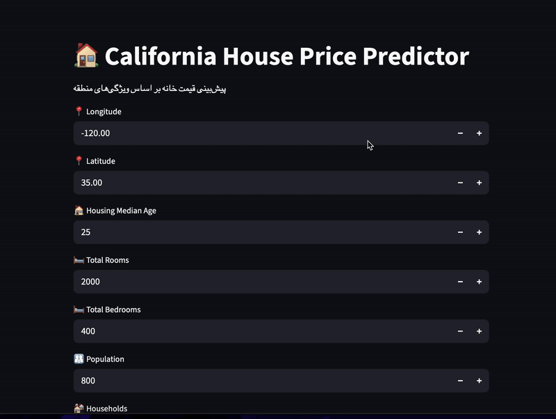

# 🏠 California Housing Price Predictor  

> **An interactive Machine Learning web app that predicts California house prices based on real-world census data.**  
> Built with ❤️ using Python, scikit-learn, and Streamlit.  

---

## 🚀 Overview  
This project uses a **Random Forest Regressor** trained on the **California Housing Dataset** to predict median house values.  
The app lets users input key features (like income, rooms, and population) and instantly get an estimated house price.  

🧠 **Model Performance:**  
- ✅ Algorithm: Random Forest Regressor  
- ✅ R² Score: **0.70**  
- ✅ MSE: 3.79e+09  
- ✅ Feature Importance: `median_income` had the highest impact (~0.5)

---

## 🧩 Features  
- Real-time price prediction  
- Interactive web interface (Streamlit)  
- Scaled input data using `StandardScaler`  
- Saved trained model (`joblib`) for deployment  
- Clean modular project structure  

---

## 🧠 Tech Stack  
| Category | Tools Used |
|-----------|-------------|
| Programming | Python 3.x |
| Libraries | scikit-learn, pandas, numpy, joblib |
| Web App | Streamlit |
| Environment | Jupyter Notebook + Streamlit |

---

## 🖼️ Demo

## 📁 Project Structure  

📦 California_Housing_Predictor
├── data/ — contains the dataset (california_housing_test.csv)
├── model/ — trained_model.pkl & scaler.pkl
├── notebooks/ — model training and analysis
├── app.py — Streamlit web app
├── requirements.txt — project dependencies
└── README.md — project documentation
